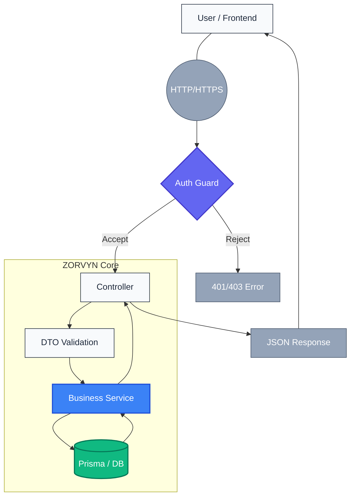

# 🌌 ZORVYN Backend: Financial Intelligence Core

[](https://nestjs.com/)
[](https://www.prisma.io/)
[](https://www.postgresql.org/)
[](https://opensource.org/licenses/MIT)

ZORVYN is a high-performance financial API core designed for secure transaction management and real-time analytical processing. Built with **NestJS** and **Prisma**, it provides a robust foundation for modern fintech ecosystems.

---

## 🚀 Live Environment

| Service | Access Link |
| :--- | :--- |
| **🌐 Live Demo** | [zorvyn-fintech-demo-production.up.railway.app](https://zorvyn-fintech-demo-production.up.railway.app) |
| **📚 API Docs (Swagger)** | [zorvyn-fintech-production.up.railway.app/api/docs](https://zorvyn-fintech-production.up.railway.app/api/docs) |
| **📡 Backend URL** | `https://zorvyn-fintech-production.up.railway.app` |

---

## 🏗️ System Architecture

The project follows a modular NestJS architecture, ensuring high maintainability and clear separation of concerns.

```text
src/
├── common/              # Cross-cutting concerns (Guards, Decorators, Filters)
├── database/            # Prisma integration and driver adapters
└── modules/
    ├── auth/            # Identity & Access Management (JWT)
    ├── users/           # User governance and Role-Based Access Control
    ├── transactions/    # Financial ledger and aggregation logic
    └── health/          # System telemetry and DB connectivity checks
```

### Flow Architecture
The following diagram illustrates the request lifecycle and component interaction within the ZORVYN ecosystem:



---

## 🔒 Core API Flows

### 1. Identity & Authentication (`/auth`)
Managed by a JWT-based security layer. On registration, users are assigned a default `VIEWER` role, which can be elevated to `ANALYST` or `ADMIN` via the User Management panel.

### 2. Transaction Ledger (`/transactions`)
The backbone of the platform. Supports full CRUD operations with high-precision decimal storage. Includes specialized analytical endpoints:
- `GET /transactions/monthly-breakdown`: Computes income vs. expense trends.
- `GET /transactions/global-analytics`: Provides platform-wide sums for elevated roles.

### 3. Role-Based Access Control (RBAC)
Architecture enforces strict permission boundaries:
- **VIEWER**: Read-only summary access.
- **ANALYST**: Access to detailed analytics and trend intelligence.
- **ADMIN**: Full clearance including user role modification and record generation.

---

## 🛠️ Technical Configuration

### Environment Variables
Configure these in your `.env` or Railway settings:

```bash
DATABASE_URL=           # PostgreSQL connection string
DIRECT_DATABASE_URL=    # PostgreSQL connection (for Prisma v7 pg-adapter)
JWT_SECRET=             # High-entropy string for token signing
FRONTEND_URL=           # The URL of your deployed frontend (for CORS)
```

### Local Development

1. **Install Dependencies**
   ```bash
   npm install
   ```

2. **Initialize Database**
   ```bash
   npx prisma generate
   npx prisma migrate dev
   ```

3. **Launch Server**
   ```bash
   npm run start:dev
   ```

---

## 🛡️ Telemetry & Monitoring

Deployments include a `/health` endpoint designed for Railway's monitoring. It performs real-time verification of the database pool status and schema availability.

> [!TIP]
> Visit `/health` any time to confirm that the backend-to-database link is operational.

---